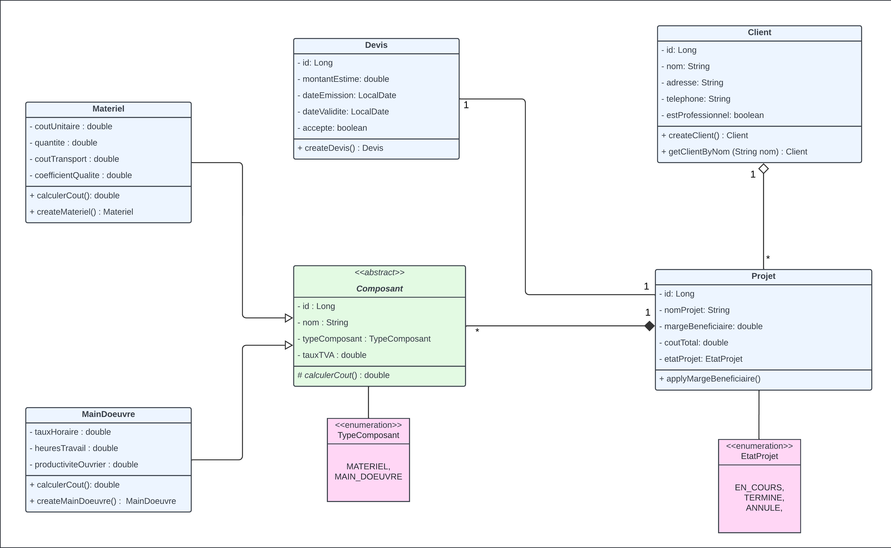

# Bati-Cuisine: Application d'estimation des coûts de construction des cuisines

## Description
Bati-Cuisine est une application console Java destinée aux professionnels de la construction et de la rénovation de cuisines. L'application calcule le coût total des travaux en tenant compte des matériaux utilisés et du coût de la main-d'œuvre, cette dernière étant facturée à l'heure.

## Fonctionnalités
- Gestion des clients (particuliers et professionnels)
- Création et gestion de projets de rénovation
- Ajout de matériaux et de main-d'œuvre aux projets
- Calcul détaillé des coûts de projet
- Génération de devis
- Application de remises selon le type de client

## Diagramme de classes



## Prérequis
- Java 8 ou supérieur
- PostgreSQL 12 ou supérieur

## Installation
1. Clonez ce dépôt : `git clone https://github.com/HMZElidrissi/bati-cuisine.git`
2. Importez le projet dans votre IDE préféré
3. Créez une base de données PostgreSQL nommée `bati-cuisine`
4. Exécutez le script `migrations.sql` pour créer les tables nécessaires
5. Modifiez les variables `DB_URL`, `DB_USER` et `DB_PASSWORD` dans la classe `Database` pour correspondre à votre configuration PostgreSQL
6. Générez le fichier JAR exécutable en exécutant la commande: 

    ```shell
    javac -d bin -cp src src/**/*.java
    jar cvfm bati-cuisine.jar META-INF/MANIFEST.MF -C bin .
    java -jar bati-cuisine.jar
    ```
>> `java -cp bati-cuisine.jar:postgresql-42.7.4.jar Main` pour spécifier le chemin du driver PostgreSQL

## Structure du projet
- `src/model/` : Contient les classes de modèle (Client, Projet, Composant, etc.)
- `src/repository/` : Contient les interfaces et implémentations des repositories
- `src/service/` : Contient les classes de service qui gèrent la logique métier
- `src/util/` : Contient les classes utilitaires (CLI, InputValidator, etc.)
- `src/Main.java` : Point d'entrée de l'application
